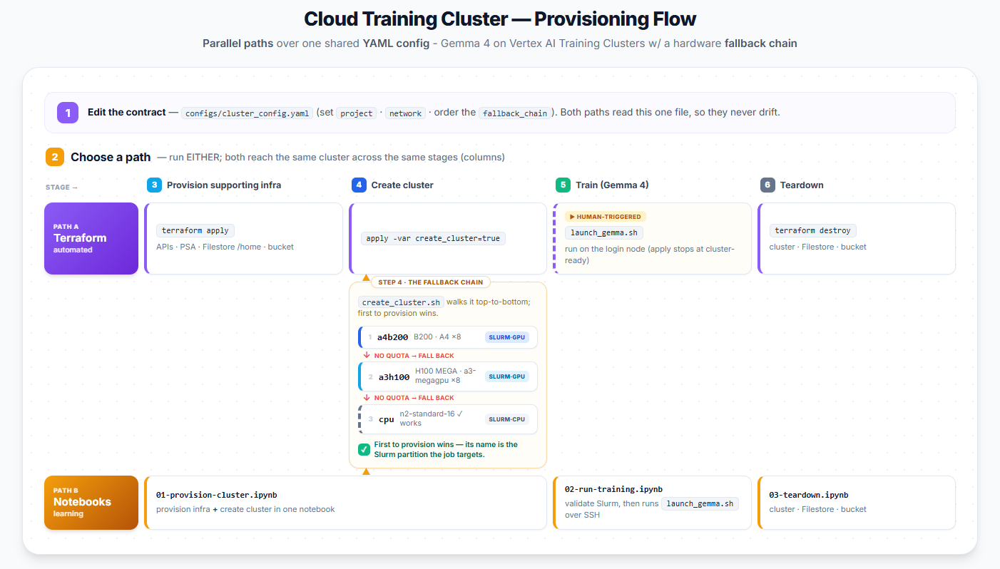

# Google Cloud Training Cluster

This repo is a **managed way to run GE Agent Platform Training Clusters (VTC)** for large-model training on Google Cloud, built around a **hardware fallback chain**. The user declares a custom ordered list of accelerators (newest GPU → prior-gen GPU → CPU). When the first choice is out of capacity, creation falls through to the next instead of failing.



The worked example trains **Gemma 4** on **GPU (NeMo-Run / Slurm)**. **TPU (MaxText / GKE)** support is planned, so the system is wired in the config but disabled until the v1beta1 API exposes TPU/GKE fields (see [Notes & caveats](#notes--caveats)).

Everything is driven by a shared single config file (`configs/cluster_config.yaml`), read by two paths that reach the **same cluster-ready state via the same scripts**:
* **Terraform (automated / demo)** — `apply` runs the shared `scripts/create_cluster.sh` (via `local-exec`) to stand up the cluster as IaC.
* **Notebooks (learning)** — the mirror: step through the same flow by hand (PDF runbook, Steps 1–5), editing parameters with `@param`, regenerating the config, and calling those same shared scripts so nothing diverges.

Both stop at **cluster-ready**; launching the Gemma recipe is one shared on-node step (`scripts/jobs/launch_gemma.sh`) that notebook 02 runs for you over SSH.

> **Preview.** VTC (`modelDevelopmentClusters`, v1beta1) is a Preview service and typically allowlisted — contact your account team for access. GPU and CPU profiles ride **Slurm**; TPU isn't exposed by this API yet (see [Notes & caveats](#notes--caveats)).

## Config is the contract

`configs/cluster_config.yaml` is the single source of truth both paths read, so they never drift:
* **Terraform** loads it with `yamldecode` (`terraform/main.tf`) to resolve project, network, storage, and the fallback chain.
* **Notebooks** regenerate the *same file* from `@param` form values via the build cell, then call the same scripts.

The cluster spec is never hand-written twice. `scripts/render_cluster_json.py` is the one place that turns a profile into the v1beta1 request body, and `scripts/create_cluster.sh` is the one place the fallback chain is walked — both paths call them.

### The fallback chain

```yaml
fallback_chain:
  - name: a4b200   # NVIDIA B200 (A4)        — scarcest, usually reserved
  - name: a3h100   # NVIDIA H100 (A3 Mega)   — broader availability
  - name: cpu      # n2-standard-16          — last resort, validates plumbing
  # - name: tpuv5e # TPU v5e — DISABLED: this API has no TPU/GKE fields (see Notes & caveats)
```

List your preferred hardware first and end with `cpu`, so a run can always validate networking + Filestore `/home` + Slurm before consuming accelerators. The fallback fires on a failed **create operation** (stockout / quota / capacity / not allowlisted). Once a cluster is *up*, in-flight hardware faults are VTC's own job — it detects, remediates (restart / reimage / replace), and resumes from checkpoint.

## Getting started

**1. Clone the repo.**

**2. Edit `configs/cluster_config.yaml`** — set `project.id`, `project.region`/`zone`, your `network` (VPC + subnet must already exist), and reorder `fallback_chain` to your allowlisted hardware.

**3. Choose a path (run EITHER).** Both are functional twins — you don't need Terraform before the notebooks.

### Path A — Terraform (automated)

Terraform owns everything *around* the cluster (APIs, PSA peering, Filestore, the code-transfer bucket) declaratively, then hands cluster creation to `scripts/create_cluster.sh` (there's no native TF resource for VTC yet). Cluster creation is gated OFF by default, so a first apply just stands up the plumbing.

```bash
cd terraform
cp terraform.tfvars.example terraform.tfvars   # set project_id
terraform init && terraform apply                          # APIs + PSA + Filestore + bucket
terraform apply -var create_cluster=true -var profiles=cpu # validate: CPU cluster only (no scarce GPU) — works today
terraform apply -var create_cluster=true                   # or walk the full chain (a4b200 → a3h100 → cpu)
```

`terraform destroy` removes the cluster (via its destroy provisioner), Filestore, and bucket together. Requires `gcloud` (authenticated) + `python3`/PyYAML wherever Terraform runs, since the create script calls the REST API directly.

### Path B — Notebooks (hands-on / learning)

```text
notebooks/
├── 01-provision-cluster.ipynb   # params + write the config, APIs, PSA, Filestore, bucket, create (fallback)
├── 02-run-training.ipynb        # SSH, validate Slurm, smoke test, stage + launch Gemma (GPU/TPU)
└── 03-teardown.ipynb            # delete cluster, Filestore, bucket
```

Notebook 01 uses `@param` for the knobs and writes `configs/cluster_config.yaml` from them, then mirrors the PDF runbook's `gcloud` setup and calls `scripts/create_cluster.sh`. Start with the `--dry-run` cell (prints the request bodies) or `--profiles cpu` (cheap plumbing check) before committing to accelerators.

## Stage training code

The launchers expect the recipe tree in the code-transfer bucket. Stage it once from wherever you have the checkout:

```bash
# GPU (NeMo-Run)
gcloud storage cp -r <path-to>/nemo gs://<project>-vtc-temp/nemo/
# TPU (MaxText)
gcloud storage cp -r <path-to>/maxtext gs://<project>-vtc-temp/maxtext/
```

`scripts/jobs/launch_gemma.sh` pulls it onto the login node and runs the recipe named in `workload` — NeMo `run.py` for GPU, MaxText `train.py` for TPU.

## Prerequisites

IAM + tooling to provision and reach VTC:
- IAM: Vertex AI Administrator, Filestore Editor, Compute Network Admin, Storage Admin, **Compute OS Login** (for login-node SSH). See `IAM-PLAN.md` for the full set as Terraform.
- VTC allowlisting (Preview); **A3/A4 GPU quota** for GPU clusters (this project has none yet → CPU works today).
- An existing VPC + subnet in `project.region`.
- Local tooling: `gcloud` (with Application Default Credentials), `python3` + `PyYAML`, and `terraform` for Path A.

## Repo layout

```text
.
├── configs/
│   └── cluster_config.yaml      : The contract — project, network, storage, fallback_chain, Gemma workload.
├── scripts/
│   ├── render_cluster_json.py   : One profile -> v1beta1 modelDevelopmentClusters request body (--list-profiles).
│   ├── create_cluster.sh        : Walk the fallback chain — render, POST, poll LRO, stop on first success.
│   ├── delete_cluster.sh        : Delete the cluster (reads .vtc_cluster_state or --cluster-id).
│   └── jobs/
│       ├── cpu_smoke_test.sh    : SBATCH smoke test — places a job on a worker, writes to /home.
│       └── launch_gemma.sh      : Launch Gemma — NeMo (GPU/Slurm) or MaxText (TPU/GKE).
├── terraform/
│   ├── main.tf                  : yamldecode the contract; resolve project/region/storage.
│   ├── apis.tf                  : Enable the required APIs.
│   ├── network.tf               : Private Services Access peering (for Filestore).
│   ├── filestore.tf             : Shared /home Filestore instance.
│   ├── storage.tf               : Code-transfer bucket.
│   ├── cluster.tf               : null_resource -> create_cluster.sh (gated by create_cluster).
│   ├── variables.tf / outputs.tf / versions.tf / terraform.tfvars.example
└── notebooks/                   : Path B walkthrough (01 provision · 02 train · 03 teardown) — the learning mirror of Path A.
```

## Notes & caveats

- **No native TF resource for VTC.** The cluster is created by `scripts/create_cluster.sh` from a `null_resource`; `terraform destroy` removes it. Re-creation triggers on a change to the config, id, or profile subset.
- **Fallback is creation-time only.** It reacts to a failed create operation; steady-state hardware faults are handled by VTC itself.
- **Cluster id ≤ 10 chars**, unique — left blank, it's derived from `workload.model`.

## Future work

- **Submit from GKE.** The `gke/` folder lets a GKE shop drive VTC from inside Kubernetes via Workload Identity (no keys), reusing the same config + scripts — see [`gke/README.md`](./gke/README.md).
- **TPU.** Re-enable the `tpuv5e` profile (MaxText on GKE) once the VTC API exposes TPU/GKE fields.

## References

- [Vertex AI training clusters — overview](https://docs.cloud.google.com/gemini-enterprise-agent-platform/machine-learning/training/training-clusters/overview) · [get started](https://docs.cloud.google.com/gemini-enterprise-agent-platform/machine-learning/training/training-clusters/get-started) · [create a cluster](https://docs.cloud.google.com/gemini-enterprise-agent-platform/machine-learning/training/training-clusters/create-cluster)
- [Run prebuilt workloads](https://docs.cloud.google.com/gemini-enterprise-agent-platform/machine-learning/training/training-clusters/run-prebuilt-workloads) · [networking](https://docs.cloud.google.com/gemini-enterprise-agent-platform/machine-learning/training/training-clusters/networking) · [storage](https://docs.cloud.google.com/gemini-enterprise-agent-platform/machine-learning/training/training-clusters/storage)
- [Gemma — get started](https://ai.google.dev/gemma/docs/get_started) · [distributed tuning](https://ai.google.dev/gemma/docs/core/distributed_tuning) · [model card](https://www.kaggle.com/models/google/gemma-4)
- [Plan TPUs in GKE](https://docs.cloud.google.com/kubernetes-engine/docs/concepts/plan-tpus) · [TPU regions & zones](https://docs.cloud.google.com/tpu/docs/regions-zones)
